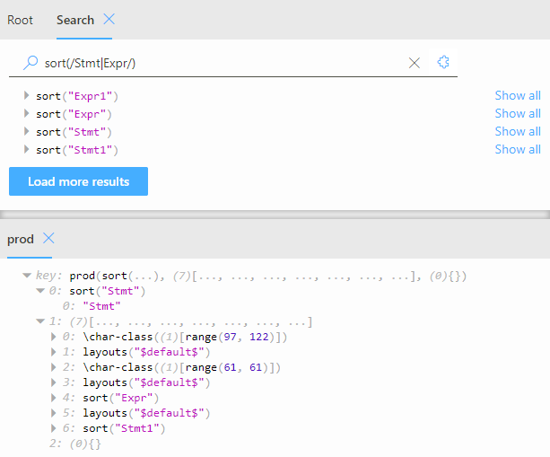

# rascal-vis

Rascal-vis is a tool for exploring Rascal values. It has an interactive tree view for any value, and has special graphical representations for grammars and simple diagrams. 


## Usage

The tool can either be accessed online at [https://tarvk.github.io/rascal-vis/fe/build](https://tarvk.github.io/rascal-vis/fe/build/). Note that the server synchronization feature will not work here with `localhost`.

For usage with localhost, the tool could be ran locally. Make sure you have [nodejs](https://nodejs.org/en) installed, clone the repository, and navigate to the `fe` directory. From here, run the following command once after cloning:
```
npm install
```
Afterwards, any time you want to use to the tool you can run the following command:
```
npm start
```
The tool should now be available in the browser at (http://localhost:3000/)[http://localhost:3000/]. 


## Features

### Synchronization

You have the option to provide values either manually or retrieve them from a server. Simply head to the input panel to make your selection. To send values directly from Rascal, you can set the address to `http://localhost:10001/data` and use the `visualize(yourValue)` function in Rascal. To stop visualizing, simply call `stopVisualize()`.


### Visualizations

The tool provides various methods for data exploration based on their data type. If there are multiple applicable visualizations, you'll find a visualization selector located in the top right corner, allowing you to choose the desired visualization option.


#### Inspector 

The inspector is the base visualization in the tool, similar to those found in other environments like JavaScript tools in web browsers. It is always available regardless of the value's data type and enables you to concentrate on specific sections of the data. You can drag values into new panels to compare them side by side, offering a convenient way to analyze different aspects. Additionally, right-clicking provides access to further options through the context menu.


#### Grammars

Grammars can be visualized in a manner closely resembling their definition in Rascal. This visualization offers a concise view that maintains the visibility of the relationships between various symbols within the grammar.


#### Graphs

While the tool currently supports node graph visualization, it is important to note that this feature is not yet fully optimized. However, there are plans to enhance node graph capabilities by introducing diagrams in the future. These additions will improve the visualization and understanding of node graphs within the tool.


### Panels

The tool offers a robust panel system that empowers you to arrange and organize components optimally based on your specific scenario. You have the flexibility to place panels side by side, resize them as needed, or group them in different tabs. This feature enables you to customize the layout of the tool to suit your preferences and efficiently work with your data.


### Highlighting

Values in the tool can be highlighted in different ways to emphasize their connections. You have the option to hover over a value to see a temporary highlight, apply a permanent highlight to keep it visible, or focus on a specific value to emphasize its connections with other values. These highlighting features facilitate a better understanding of the relationships between values within the tool.


### Search

The tool provides a convenient search system to quickly locate specific elements. Simply head to the search panel to perform a query. It offers two types of searches: plain text search and structured search.

The plain text search allows you to search for strings, numbers, and constructor names using simple text queries.

The structured search, on the other hand, enables you to utilize patterns similar to those in Rascal. For example, you can search for instances of a specific constructor with certain parameter values by using patterns like `myConstr(_, 4)`. You can also search through lists using patterns like `[_*, 4, _*, 4, _*]` to find a list with two copies of the value 4.

Additionally, JavaScript regular expressions can be used within your search to match specific texts. For instance, you can search for an instance of your constructor where the first value is a string containing the word `some` by using `myConstr(/some/, _)`.

These search features offer flexibility and versatility in locating desired elements within the tool.



### Settings

The tool offers global settings that can be customized according to your preferences. All data, including the current panel layout and their internal data, is stored locally in local storage. Simply head to the settings panel to make changes to these settings.

Furthermore, the tool supports the creation of multiple profiles, allowing you to set up and switch between different predetermined layouts effortlessly. This feature enables you to maintain multiple configurations tailored to specific needs or contexts, enhancing your overall user experience.


### Value controls

In the tool, there are dedicated value constructors that hold special meaning and allow you to manipulate the layout and other application state using these values. This functionality is particularly useful when making changes directly from within Rascal, the source of the data.

For example, you can utilize the `VTab` constructor within the value tree, as follows: `VTab(myValue("some value"), name="something")`. This will automatically open the corresponding value `myValue("something")` in a tab with the specified name, in this case "something".

By leveraging these special value constructors, you can efficiently control and customize the layout and application state, enhancing your workflow when working with data originating from Rascal.

### Dark/light mode

Two color themes are provided: a dark mode and a light mode. The toggle in the bottom left of the page can be used to switch between these modes. 


## TODO

I do not plan to work on this tool in the near future, but there are still several known issues and directions for expansion:
- Finish graph visualization:
    - Save manual layout changes
    - Add highlight synchronization
    - Fix issues when resizing the panel
- Finish set and map search: Make sure that each pattern can only match once. 
    - E.g. currently pattern `{0}` incorrectly matches `{0, 0}`.
    - E.g. currently pattern `(_:1)` incorrectly matches `("a":1, "b":1)`.
- Add statistical graph types:
    - Scatter plot
    - Box plot
    - Bar Chart
    - Pie Chart
    - Line graph
    - Histogram
    - Heat map

